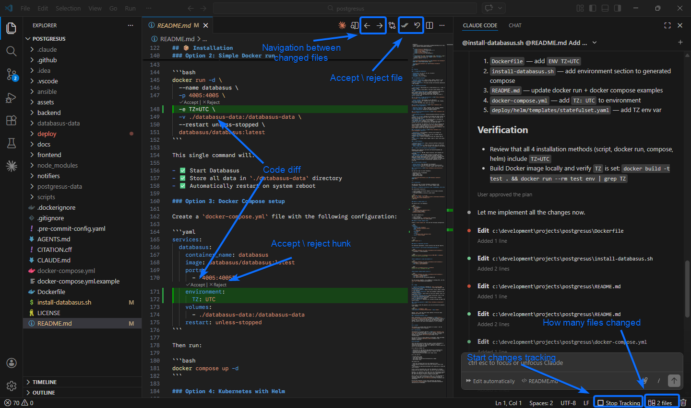
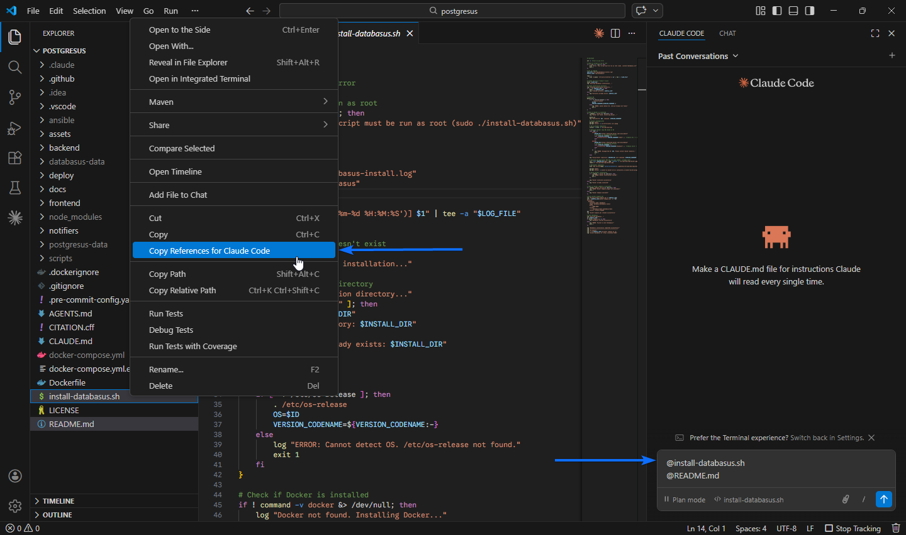

# Diffus

VS Code extension for inline diff review while working with CLI AI tools (Claude Code, Codex, etc.).

CLI AI tools modify files directly on disk but only show diffs in the terminal, which is hard to read and interact with. Diffus brings Cursor-style inline diff review to VS Code — snapshot your workspace, let the AI make changes, then review every hunk with accept/reject controls right in the editor.

## Examples

### Changes Tracking



### References Copier



## How It Works

1. Click **Start Tracking** in the status bar — Diffus snapshots all workspace files.
2. Let your CLI AI tool make changes — Diffus detects them via filesystem watcher.
3. Review diffs inline: added lines in green, removed lines as red ghost lines above.
4. **Accept** or **Reject** each hunk, or use **Accept All / Reject All** per file.
5. Navigate between changed files with **Back / Next** buttons in the editor title bar.

## Features

- **Inline diff rendering** — added lines highlighted green, removed lines shown as red ghost lines with red left border (no side-by-side view needed)
- **Keyboard-driven review** — `Tab` to accept hunk, `Escape` to reject — works only when cursor is inside a hunk, doesn't interfere with autocomplete, snippets, find widget, etc.
- **Auto-navigation** — after accepting/rejecting a hunk, automatically jumps to the next hunk in the same file or opens the next changed file
- **Auto-open on changes** — when the filesystem watcher detects AI changes, automatically opens the first changed file (with 500ms debounce)
- **Per-hunk accept/reject** — CodeLens actions on each hunk
- **Per-file accept all / reject all** — editor title bar buttons
- **File navigation** — Back/Next buttons with file counter (e.g. "2 / 5 files")
- **Status bar toggle** — Start/Stop tracking with changed file count badge
- **Debounced watching** — handles rapid multi-file saves without flickering
- **Session persistence** — stop tracking and still review pending diffs; start a new session without losing unreviewed changes

## Commands & Keybindings

| Command                 | Keybinding | Description                         |
| ----------------------- | ---------- | ----------------------------------- |
| `diffus.toggleTracking` |            | Toggle tracking on/off (status bar) |
| `diffus.startTracking`  |            | Start tracking changes              |
| `diffus.stopTracking`   |            | Stop tracking changes               |
| `diffus.nextFile`       | `Alt+]`    | Next changed file                   |
| `diffus.prevFile`       | `Alt+[`    | Previous changed file               |
| `diffus.acceptHunk`     | `Tab`      | Accept hunk at cursor               |
| `diffus.rejectHunk`     | `Escape`   | Reject hunk at cursor               |
| `diffus.acceptAllFile`  |            | Accept all hunks in file            |
| `diffus.rejectAllFile`  |            | Reject all hunks in file            |

> `Tab` and `Escape` are only active when the cursor is inside a diff hunk. They won't interfere with normal editing, autocomplete, snippets, find widget, or any other VS Code functionality.

## Install

```bash
npx @vscode/vsce package
code --install-extension diffus-0.1.0.vsix
```

## Tech Stack

- TypeScript
- VS Code Extension API (no Webview)
- Local VSIX install (not on Marketplace)
